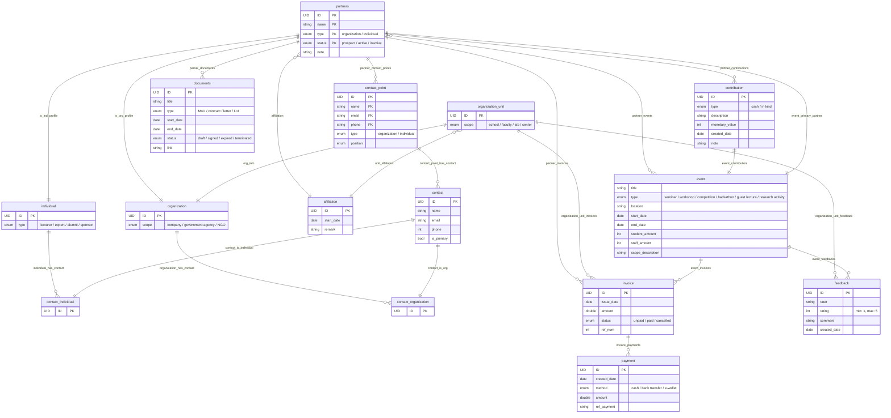

```mermaid
erDiagram
	direction TB
	partners {
		UID ID PK ""  
		string name PK ""  
		enum type PK "organization / individual"  
		enum status PK "prospect / active / inactive"  
		string note  ""  
	}

	organization {
		UID ID PK ""  
		enum scope  "company / government agency / NGO"  
	}

	individual {
		UID ID PK ""  
		enum type  "lecturer / expert / alumni / sponsor"  
	}

	affiliation {
		UID ID PK ""  
		date start_date  ""  
		string remark  ""  
	}

	organization_unit {
		UID ID PK ""  
		enum scope  "school / faculty / lab / center"  
	}

	contact_point {
		UID ID PK ""  
		string name PK ""  
		string email PK ""  
		string phone PK ""  
		enum type  "organization / individual"  
		enum position  ""  
	}

	contact {
		UID ID PK ""  
		string name  ""  
		string email  ""  
		int phone  ""  
		bool is_primary  ""  
	}

	contact_individual {
		UID ID PK
	}

	contact_organization {
		UID ID PK
	}

	documents {
		UID ID PK ""  
		string title  ""  
		enum type  "MoU / contract / letter / LoI"  
		date start_date  ""  
		date end_date  ""  
		enum status  "draft / signed / expired / terminated"  
		string link  ""  
	}

	event {
		string title  ""  
		enum type  "seminar / workshop / competition / hackathon / guest lecture / research activity"  
		string location  ""  
		date start_date  ""  
		date end_date  ""  
		int student_amount  ""  
		int staff_amount  ""  
		string scope_description  ""  
	}

	invoice {
		UID ID PK ""  
		date issue_date  ""  
		double amount  ""  
		enum status  "unpaid / paid / cancelled"  
		int ref_num  ""  
	}

	payment {
		UID ID PK ""  
		date created_date  ""  
		enum method  "cash / bank transfer / e-wallet"  
		double amount  ""  
		string ref_payment  ""  
	}

	contribution {
		UID ID PK ""  
		enum type  "cash / in kind"  
		string description  ""  
		int monetary_value  ""  
		date created_date  ""  
		string note  ""  
	}

	feedback {
		UID ID PK ""  
		string rater  ""  
		int rating  "min: 1, max: 5"  
		string comment  ""  
		date created_date  ""  
	}

	partners||--||organization:"is_org_profile"
	partners||--||individual:"is_ind_profile"
	partners||--o{contact_point:"partner_contact_points"
	partners}o--||affiliation:"affiliation"
	partners||--o{documents:"parner_documents"
	partners}o--o{event:"partner_events"
	partners||--o{contribution:"partner_contributions"
	partners||--o{invoice:"partner_invoices"
	individual||--o{contact_individual:"individual_has_contact"
	organization||--o{contact_organization:"organization_has_contact"
	organization_unit}o--||affiliation:"unit_affiliation"
	organization_unit||--||organization:"org_info"
	organization_unit||--o{invoice:"organization_unit_invoices"
	organization_unit||--o{feedback:"organization_unit_feedback"
	contact_point||--o{contact:"contact_point_has_contact"
	contact||--||contact_organization:"contact_is_org"
	contact||--||contact_individual:"contact_is_individual"
	event||--||partners:"event_primary_partner"
	event||--o{invoice:"event_invoices"
	event||--o{feedback:"event_feedbacks"
	contribution||--||event:"event_contribution"
	invoice||--o{payment:"invoice_payments"
```